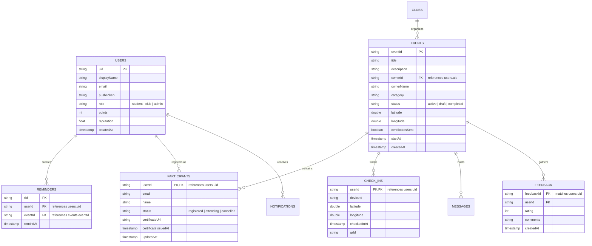
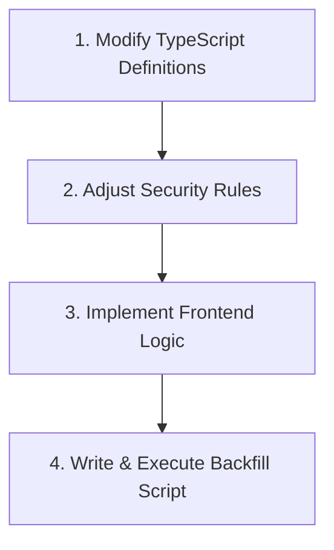

# UniEvent Database Data Model & Schema Specification

This document details the complete data model, collection schemas, entity relationships, indexing structures, and denormalization paradigms powering the UniEvent ecosystem. UniEvent utilizes Google Cloud Firestore, a highly scalable, serverless NoSQL document database.

---

## Table of Contents

- [1. Entity-Relationship Diagram](#1-entity-relationship-diagram)
- [2. Database Paradigm Overview](#2-database-paradigm-overview)
- [3. Collection Schemas & Example Documents](#3-collection-schemas--example-documents)
  - [3.1 Users Collection (`/users`)](#31-users-collection-users)
  - [3.2 Events Collection (`/events`)](#32-events-collection-events)
  - [3.3 Attendance Subcollection (`/events/{eventId}/checkIns`)](#33-attendance-subcollection-eventseventidcheckins)
  - [3.4 Feedback Collection (`/feedback` and `/events/{eventId}/feedback`)](#34-feedback-collection-feedback-and-eventseventidfeedback)
  - [3.5 Certificates Storage (`/events/{eventId}/participants`)](#35-certificates-storage-eventseventidparticipants)
- [4. Query Indexing Strategy](#4-query-indexing-strategy)
- [5. Denormalization Choices & Structural Trade-offs](#5-denormalization-choices--structural-trade-offs)
- [6. SOP: Adding New Fields & Modifying Schema](#6-sop-adding-new-fields--modifying-schema)

---

## 1. Entity-Relationship Diagram

The relationships between UniEvent data entities are mapped below. While Firestore is schema-less by nature, the application enforces logical constraints and parent-child hierarchies via subcollections.



---

## 2. Database Paradigm Overview

UniEvent uses a hybrid Firestore structure combining **Root-Level Collections** and **Nested Subcollections** to optimize queries, limit document sizes, and strictly manage authorization boundaries.

- **Root-Level Collections**: Designed for global data entities accessed independently, such as `/users`, `/events`, `/clubs`, or `/reminders`.
- **Nested Subcollections**: Leveraged for high-frequency event contexts. For example, `participants`, `checkIns`, `messages`, and `feedback` live inside `/events/{eventId}/...` as subcollections. This prevents event documents from exceeding Firestore's maximum document size limit of **1 MiB** as registrations scale.

---

## 3. Collection Schemas & Example Documents

### 3.1 Users Collection (`/users`)

This collection contains user profiles, system configuration configurations, push tokens, and reputation metrics.

#### Schema

| Field Name | Type | Description |
| :--- | :--- | :--- |
| `uid` | `string` | **Document ID**. Matches Firebase Authentication user ID (`auth.uid`). |
| `displayName` | `string` | Full name of the user. |
| `email` | `string` | Verified email address. |
| `pushToken` | `string` | Expo Push Token used to deliver targeted mobile notifications. |
| `role` | `string` | Defines security tier: `"student"`, `"club"`, or `"admin"`. |
| `points` | `integer` | Points accumulated via participation, used for rankings. |
| `reputation` | `number` | Reliability score derived from attendance and show-up ratios. |
| `createdAt` | `timestamp` | Date and time of registration. |

#### Full Example Document

```json
{
  "displayName": "Jane Doe",
  "email": "jane.doe@university.edu",
  "pushToken": "ExponentPushToken[AbCdEfGhIjKlMnOpQrStUv]",
  "role": "student",
  "points": 350,
  "reputation": 94.5,
  "createdAt": {
    "_seconds": 1774783200,
    "_nanoseconds": 500000000
  }
}
```

---

### 3.2 Events Collection (`/events`)

Contains core event metadata, venue coordinates, administrative status flags, and certificate execution progress details.

#### Schema

| Field Name | Type | Description |
| :--- | :--- | :--- |
| `eventId` | `string` | **Document ID**. Unique UUID representing the event. |
| `title` | `string` | Name of the event. |
| `description` | `string` | Detailed contextual description. |
| `ownerId` | `string` | Creator's unique identifier (points to `/users/{uid}`). |
| `ownerName` | `string` | Cached display name of the event organizer. |
| `category` | `string` | Topic classifications (e.g. `"Technology"`, `"Arts"`, `"Career"`). |
| `status` | `string` | Runtime workflow status: `"draft"`, `"active"`, or `"completed"`. |
| `latitude` | `number` | GPS latitude coordinate of the event venue. |
| `longitude` | `number` | GPS longitude coordinate of the event venue. |
| `certificatesSent`| `boolean` | Flag set to `true` when certificates have been distributed. |
| `certificatesSentAt` | `timestamp` | Datetime of dynamic certificate email push completion. |
| `startAt` | `timestamp` | Event kickoff date and time. |
| `createdAt` | `timestamp` | Datetime of database record initialization. |

#### Full Example Document

```json
{
  "title": "University Hackathon 2026",
  "description": "Annual 24-hour programming hackathon and building challenge.",
  "ownerId": "usr_987654321",
  "ownerName": "Computer Science Club",
  "category": "Technology",
  "status": "active",
  "latitude": 37.7749,
  "longitude": -122.4194,
  "certificatesSent": false,
  "startAt": {
    "_seconds": 1774888800,
    "_nanoseconds": 0
  },
  "createdAt": {
    "_seconds": 1774600000,
    "_nanoseconds": 0
  }
}
```

---

### 3.3 Attendance Subcollection (`/events/{eventId}/checkIns`)

Saves high-frequency geolocation, device fingerprinting, and cryptographic verification values generated when checking in.

#### Schema

| Field Name | Type | Description |
| :--- | :--- | :--- |
| `userId` | `string` | **Document ID**. User ID of the attendee. Identifies the record. |
| `deviceId` | `string` | Hardware fingerprint used to prevent multi-account proxy voting. |
| `latitude` | `number` | The GPS latitude recorded by the attendee's mobile device. |
| `longitude` | `number` | The GPS longitude recorded by the attendee's mobile device. |
| `checkedInAt` | `timestamp` | Datetime of verified successful QR scanner check-in. |
| `qrId` | `string` | Cryptographic identifier of the dynamic QR code scanned. |

#### Full Example Document

```json
{
  "userId": "usr_123456789",
  "deviceId": "HW_FINGERPRINT_FF99AA22",
  "latitude": 37.7751,
  "longitude": -122.4192,
  "checkedInAt": {
    "_seconds": 1774890000,
    "_nanoseconds": 250000000
  },
  "qrId": "qr_hash_dynamic_a1b2c3d4"
}
```

---

### 3.4 Feedback Collection (`/feedback` and `/events/{eventId}/feedback`)

Feedback can be registered through two schemas depending on runtime execution:
1. **General Feedback**: Root collection `/feedback/{docId}` tracking general platform or club feedback.
2. **Event Feedback**: nested `/events/{eventId}/feedback/{userId}` collection storing event-specific satisfaction metrics.

#### Schema

| Field Name | Type | Description |
| :--- | :--- | :--- |
| `feedbackId` | `string` | **Document ID**. Set to the user's UID to enforce a one-per-user limit. |
| `userId` | `string` | User ID of the submitting student. |
| `eventId` | `string` | Target event being rated (optional for platform feedback). |
| `rating` | `integer` | Satisfaction score rating scale from 1 (poor) to 5 (excellent). |
| `comments` | `string` | Freeform text feedback review. |
| `createdAt` | `timestamp` | Datetime of submission. |

#### Full Example Document

```json
{
  "userId": "usr_123456789",
  "eventId": "evt_hackathon2026",
  "rating": 5,
  "comments": "Exceptional venue, high quality mentors, and incredible food!",
  "createdAt": {
    "_seconds": 1774900000,
    "_nanoseconds": 0
  }
}
```

---

### 3.5 Certificates Storage (`/events/{eventId}/participants`)

To ensure atomic reading and avoid massive subcollection scanning, certificate information is directly attached to the corresponding `participant` document within the event's registrations subcollection.

#### Schema

| Field Name | Type | Description |
| :--- | :--- | :--- |
| `participantId` | `string` | **Document ID**. User ID representing the registered attendee. |
| `email` | `string` | Cached email address where the certificate notification was sent. |
| `name` | `string` | Cached name printed on the PDF certificate. |
| `status` | `string` | Registration status: `"registered"`, `"attending"`, or `"cancelled"`. |
| `certificateUrl` | `string` | Direct signed Google Cloud Storage PDF url download link. |
| `certificateIssuedAt` | `timestamp` | Server datetime representing certificate generation. |
| `updatedAt` | `timestamp` | Datetime of the last state change. |

#### Full Example Document

```json
{
  "email": "jane.doe@university.edu",
  "name": "Jane Doe",
  "status": "attending",
  "certificateUrl": "https://storage.googleapis.com/uni-event.appspot.com/certificates/evt_hackathon2026/usr_123456789.pdf?GoogleAccessId=...",
  "certificateIssuedAt": {
    "_seconds": 1774960000,
    "_nanoseconds": 880000000
  },
  "updatedAt": {
    "_seconds": 1774960000,
    "_nanoseconds": 900000000
  }
}
```

---

## 4. Query Indexing Strategy

Firestore requires explicit indexes for complex composite queries (e.g. combined filters and sorting). Below is an analysis of the compiled configurations specified inside [firestore.indexes.json](../firestore.indexes.json):

### Compound Indexes Defined

1. **`events` collection: `ownerId` (ASC) + `feedbackRequestSent` (ASC)**
   - *Why*: Allows organizers to query their own events that are pending or have completed automated feedback delivery workflows without processing others.
2. **`feedbackRequests` collection: `userId` (ASC) + `status` (ASC)**
   - *Why*: Used by schedulers to gather pending feedback requests for a specific user to prevent duplicate push prompts.
3. **`events` collection: `status` (ASC) + `startAt` (ASC)**
   - *Why*: Queries active events sorted chronologically (e.g., "Show upcoming events first on Home screen").
4. **`events` collection: `status` (ASC) + `startAt` (DESC)**
   - *Why*: Queries past events sorted reverse-chronologically (e.g., "Show recently completed events on Profile history").
5. **`events` collection: `status` (ASC) + `category` (ASC) + `startAt` (ASC)**
   - *Why*: Powers search dashboards with multi-category filters while maintaining chronological ordering.

---

## 5. Denormalization Choices & Structural Trade-offs

In a NoSQL environment like Firestore, denormalization (duplicating data across collections) is an essential design choice.

### 5.1 Cached Display Names (`events.ownerName`, `participants.name`)
- **Choice**: Storing organizer and participant names directly on the events and registration documents instead of querying `/users/{uid}` dynamically.
- **Trade-off**:
  - *Pro*: Drastically reduces Firestore read counts (eliminates the N+1 read problem) and database latency when loading dashboards.
  - *Con*: If a user updates their profile name, the application must run a background Cloud Function to update all historical records to maintain data consistency.

### 5.2 Certificates inside the `participants` Subcollection
- **Choice**: Certificates are not stored in a root-level `/certificates` collection, but are embedded as metadata fields (`certificateUrl`) directly within `/events/{eventId}/participants/{userId}`.
- **Trade-off**:
  - *Pro*: Optimizes security control and bounds certificate data directly with event participation.
  - *Con*: If a user wants to view "All My Certificates" globally across the app, the system must execute a high-latency **Collection Group Query** across all `participants` subcollections filtering by `userId`.

---

## 6. SOP: Adding New Fields & Modifying Schema

To add new fields to a collection schema without breaking current application deployments, follow these steps:



### Step 1: Modify TypeScript Definitions
Locate target interfaces inside the Cloud Functions workspace (e.g. `cloud-functions/src/types/`) and update type bounds:
```typescript
export interface EventData {
  title: string;
  // ...
  hasFoodAccommodations?: boolean; // Added field as optional (backward compatible)
}
```

### Step 2: Adjust Security Rules
If the new field must be protected or validated, edit [firestore.rules](../firestore.rules).
For example, to prevent students from modifying a new admin-only field `isPremiumEvent`:
```javascript
allow update: if request.auth != null && 
  !request.resource.data.diff(resource.data).affectedKeys().hasAny(['isPremiumEvent']);
```

### Step 3: Implement Frontend Operations
Update your write references within your views (e.g. [CreateEvent.js](../app/src/screens/CreateEvent.js)) using fallback checks for legacy records:
```javascript
const eventFood = eventData.hasFoodAccommodations || false; // Fallback
```

### Step 4: Write & Execute a Backfill Script
For production migrations, write an administrative node script inside a scratch folder to update historical documents with a default value.

```javascript
// Example backfill script
const admin = require('firebase-admin');
admin.initializeApp();
const db = admin.firestore();

async function backfill() {
  const snapshot = await db.collection('events').get();
  const batch = db.batch();
  
  snapshot.forEach(doc => {
    const data = doc.data();
    if (data.hasFoodAccommodations === undefined) {
      batch.update(doc.ref, { hasFoodAccommodations: false });
    }
  });
  
  await batch.commit();
  console.log("Backfill migration completed successfully!");
}
```

---

*Need support? Contact database administrators or open a ticket on [UniEvent GitHub Issues](https://github.com/roshankumar0036singh/Uni-Event/issues).*
